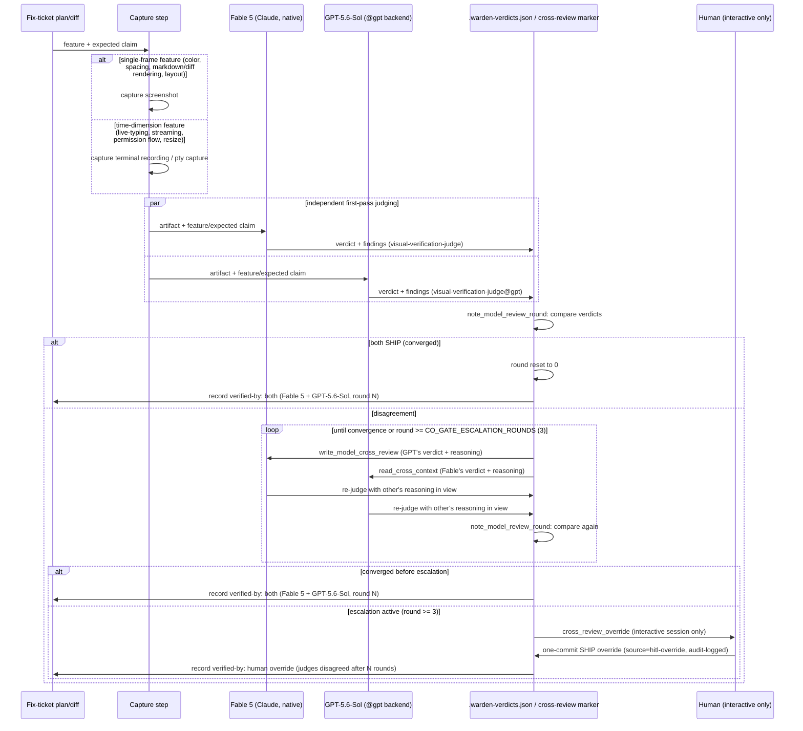

# Visual Verification Judge Pattern (Dual-Model Judging)

**Date:** 2026-07-23
**Status:** Decided (design locked — no code ships with this ADR)
**Scope:** `.claude/wardens/plan-review-rules.md` (`visual-verification-required`), `.claude/wardens/code-review-rules.md` (`visual-verification-artifact-required`), `scripts/codex_warden_hooks.py` (co-gate mechanism reused, not modified), future wardens-config wiring for a new `visual-verification-judge` role
**Related:** `.claude/wardens/plan-review-rules.md` (`visual-verification-required`), `.claude/wardens/code-review-rules.md` (`visual-verification-artifact-required`), Linear LIA-477 (wayfinder map: finish tui-v2 with real visual verification), LIA-478 (audit tui-v2 for the full visual/rendering gap inventory — first consumer of this pattern), LIA-479 (this decision), `Research/2026-07-23-deus-tui-failure-root-cause-investigation.md` (vault, not in this repo)

## Context

Two prior TUI rebuilds (LIA-471, LIA-473) shipped through 4+ plan-review rounds and 2+ code-review rounds without anyone ever actually checking rendering or visual quality — the gates that existed checked plumbing (tests, types, lint, CI), not the claim actually being made ("this renders correctly"). PR #1080 (this repo) and deus-v2#75 already closed the *recording* half of that gap: `visual-verification-required` (plan-review, blocking) now requires a plan's Verification section to name a concrete artifact of the specific feature, and `visual-verification-artifact-required` (code-review, blocking) now requires the diff to carry a minimal verification record (feature / expected / observed / disposition) alongside a corroborating artifact.

Those two rules fix what record shape is required and what artifact types are legal. They leave open:

1. Which artifact type (screenshot vs. recording) a given feature actually needs.
2. Who or what looks at the captured artifact and renders the PASS/FAIL disposition — today nothing does; the rules only require the record to exist.
3. What happens when two judges disagree about what they see.
4. Whether the verification record says who judged it — without that, a disposition is exactly as unaccountable as the missing checks that caused LIA-471/LIA-473 in the first place.

Every future tui-v2 fix-ticket plan on the LIA-477 map will need a settled answer to all four before it can satisfy the two rules above in practice. LIA-479 was created specifically to resolve them; this ADR is that ticket's required output — a locked pattern, not new code. LIA-478's audit ticket is the first ticket that needs to invoke it for real.

## Decision

### 1. Artifact type is prescribed by feature shape, not uniform

Whether a screenshot or a recording is required is determined by whether the feature has a time dimension, classified against the scenario menu already named in LIA-478 (chat, tool calls/diffs, permission prompts, markdown/code-block rendering, long sessions, terminal resizes, edge-case content):

- **Single-frame features** (color, spacing, markdown/diff/code-block rendering, static layout) → a **screenshot** is sufficient.
- **Time-dimension features** (composer live-typing tokenization highlighting, streaming render, permission-prompt flow, terminal resize behavior) → a **terminal recording or pty capture** is required — a single frame cannot demonstrate them.

**Rejected:** uniform "always capture a recording." A recording is a technical superset of a screenshot, but LIA-478's audit is explicitly wide (many small static scenarios), and mandating recording capture for all of them adds capture overhead with no corresponding gain in what's actually being checked.

### 2. New warden role `visual-verification-judge`, reusing the existing dual-backend dispatch mechanism

This repo already runs a proven per-backend warden pattern: roles such as `code-reviewer` and `plan-reviewer` dispatch through `scripts/codex_review.py` + `scripts/codex_warden_hooks.py`, producing a native/Claude ("Fable 5") verdict and a `@gpt` ("GPT-5.6-Sol")-suffixed verdict for the same role, both recorded into `.warden-verdicts.json` under `<role>` / `<role>@gpt` keys — confirmed live in `.claude/worktree-markers/*/.warden-verdicts.json` (e.g. `"plan-reviewer"` alongside `"plan-reviewer@gpt"`), and PR #1080's own description records a third GLM backend attempt that returned `COULD_NOT_RUN`.

`visual-verification-judge` is a new role name in that same family, dispatched through the identical Fable-5-native + GPT-5.6-Sol pair, with one difference in input shape: its input is an artifact path (screenshot / recording / pty capture) plus the feature and expected-behavior claim it is supposed to demonstrate, rather than a code diff.

**Rejected:** folding artifact judging into the existing `code-reviewer` role invocation. Rejected because (a) the input shape genuinely differs (artifact + claim, not a diff), and (b) a distinct role is directly reusable by LIA-478's audit, which needs to judge many artifacts independent of any single code-review pass.

### 3. Judge disagreement is resolved via the existing co-gate cross-review loop, verbatim

The repo already implements, for existing co-gated roles, an async round-based dialogue in `scripts/codex_warden_hooks.py`:

- `write_model_cross_review` — after a backend judges, its verdict + findings/summary are written to a `.{role}-cross-review.md` marker file, explicitly framed as untrusted stored-output data for the other backend to read at its next invocation, never as an instruction (`security-stored-output-trust`).
- `read_cross_context` — the other backend's next invocation is fed that verdict + reasoning directly (`"Claude {role} verdict: {verdict} — {reason}"`), length-bounded by `CROSS_REASON_MAX_CHARS`.
- `note_model_review_round` — after each round, if both backends now agree (both SHIP), the round counter resets to 0 (convergence); otherwise it increments, with a rolling history of the last 10 rounds retained. `COULD_NOT_RUN` (infra failure) touches neither convergence nor disagreement and leaves the counter untouched.
- `_co_gate_escalation_active` — true once the round counter reaches `CO_GATE_ESCALATION_ROUNDS` (defined in `scripts/warden_review/constants.py`, value `3`) non-converged rounds.
- `cross_review_override` — human-in-the-loop escalation path: usable only once escalation is active, explicitly refused in background/non-interactive sessions ("an agent must not self-approve" — `_is_bg_session` checks `CLAUDE_JOB_DIR`), records a one-commit override verdict per model backend, audit-logged distinctly (`source=hitl-override`).
- `run_warden_backends_gate` — the commit gate itself, enforcing strict AND: every configured blocking backend must be SHIP; `COULD_NOT_RUN` fails open for that backend (warn + allow, audit-logged distinctly, never treated as SHIP).

All five live in `scripts/codex_warden_hooks.py`; `CO_GATE_ESCALATION_ROUNDS` lives in `scripts/warden_review/constants.py`.

`visual-verification-judge` reuses this whole mechanism as-is, with no new infrastructure: Fable 5 and GPT-5.6-Sol each independently judge the artifact against the feature/expected claim first. On disagreement, each is shown the other's verdict and reasoning and re-judges — a genuine exchange of rationale, round over round — until they converge or hit the `CO_GATE_ESCALATION_ROUNDS` threshold, at which point, and only then, it falls to the same interactive-only human tiebreak already built for every other co-gated role.

**Rejected:**
- A third-model tiebreak (e.g. GLM, which already exists as a third code-review backend elsewhere) firing specifically on judge disagreement — rejected as unneeded new infrastructure with no demonstrated gap the existing loop doesn't already cover.
- Treating any single judge's FAIL as an immediate block with no dialogue round — rejected because it discards the one thing explicitly wanted: the models actually reasoning with each other before any escalation, not an immediate vote.

### 4. The verification record schema is extended with a `verified-by` field

The base record schema locked by PR #1080 (feature / expected / observed / disposition + artifact reference, per `visual-verification-artifact-required` in `.claude/wardens/code-review-rules.md`) is silent on who or what rendered the disposition. For `visual-verification-judge` output specifically, the record must additionally name which judge(s) produced the disposition — Fable 5 alone, GPT-5.6-Sol alone, or both after N convergence rounds if disagreement occurred. This data already exists in the co-gate loop's tracked state (which backends ran, round count in `_read_loop`/`note_model_review_round`), so surfacing it in the record costs nothing new to build.

The entire reason this pattern exists is LIA-471/LIA-473 shipping through review with no way to tell whether anyone actually looked; a bare disposition with no attribution reintroduces that exact ambiguity at the judging step itself.

**Rejected:** leaving the schema exactly as PR #1080 defined it, with judge identity left as an unrecorded implementation detail — rejected for reintroducing the attribution gap this whole effort exists to close.

### Judging flow

## Consequences

**Positive:**
- Closes the judging gap left open by PR #1080: every visual-verification checkpoint now has a defined judge, a defined disagreement-resolution path, and a defined attribution record — not just a required artifact.
- Zero new infrastructure: `visual-verification-judge` slots into the exact dual-backend dispatch, cross-review, and escalation mechanism already proven by `plan-reviewer`/`code-reviewer`, so its correctness inherits from mechanism already exercised in production rather than a fresh, unvalidated code path.
- The `verified-by` field is free to add — the co-gate loop already tracks which backends ran and the round count; this only requires surfacing existing state into the record.
- Artifact-type proportionality (screenshot vs. recording by feature shape) keeps LIA-478's wide audit tractable instead of forcing capture overhead onto every small static scenario.

**Negative:**
- No code ships with this ADR. `visual-verification-judge` does not yet exist as a runnable role — it is not registered in any wardens-config, and `scripts/codex_warden_hooks.py`/`scripts/codex_review.py` are unmodified. A future fix-ticket plan on the LIA-477 map must still implement the actual wiring (role registration, dispatch invocation, record-schema extension for `verified-by`), using this ADR as the spec. Until that wiring lands, `visual-verification-required` and `visual-verification-artifact-required` are satisfied by the record's existence, not by an actual judge verdict.
- The human-tiebreak path (`cross_review_override`) is refused in background/non-interactive sessions by design — an escalated disagreement in an unattended pipeline run will block rather than resolve until a human is at a terminal.

**Risks:**
- If the future implementation does not correctly wire `verified-by` attribution into the record before LIA-478's audit runs, the audit could produce dispositions with no recorded judge identity — silently reintroducing the exact accountability gap this ADR exists to close.
- The feature-shape classification (screenshot vs. recording) in Decision 1 relies on correct judgment at plan time about whether a feature has a time dimension; a misclassified time-dimension feature captured only as a screenshot would pass the letter of `visual-verification-required` while missing the behavior it's meant to demonstrate.

## Exit Path

This decision is REVISE-able at low cost: it locks a pattern, not code. If a future fix-ticket plan finds the co-gate reuse (Decision 3) or the artifact-type split (Decision 1) doesn't hold up in practice, revising this ADR (or superseding it) and adjusting the not-yet-written wiring costs only the design conversation plus whatever wiring work hadn't landed yet — no reversal of shipped infrastructure, since none ships here.
